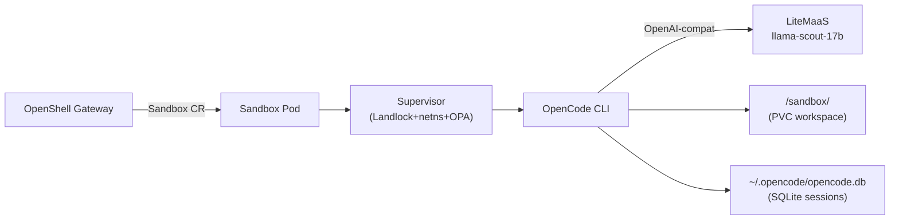

# OpenShell OpenCode Sandbox

> Back to [agent catalog](README.md) | [main doc](../openshell-integration.md)
>
> **Type:** Builtin Sandbox
> **Framework:** OpenCode CLI (open-source)
> **LLM:** OpenAI-compatible (works with LiteMaaS)
> **Supervisor:** Yes (all protection layers active)
> **Sandbox Model:** Tier 1 (OpenShell Sandbox CR, full supervisor)
> **Status:** Sandbox CR tested, LLM execution investigating (LiteMaaS compatible)

## 1. Overview

Pre-installed OpenCode CLI in the OpenShell base sandbox image. OpenCode is an
open-source, Go-based AI coding agent that supports 75+ AI models via
OpenAI-compatible API format. Unlike Claude Code, OpenCode **works with LiteMaaS**
because it uses the standard OpenAI chat/completions format.

Key advantage: OpenCode can run in **headless HTTP server mode**, making it
potentially wrappable as an A2A service without a custom adapter.

## 2. Architecture



## 3. Files

```
# No custom files — uses upstream OpenShell base image
# Image: ghcr.io/nvidia/openshell-community/sandboxes/base:latest (~1.1GB)
# CRD: agents.x-k8s.io/v1alpha1 Sandbox
```

## 4. Deployment

Same as openshell-claude — create a Sandbox CR with the base image.

### LLM Provider Configuration
```bash
kubectl set env statefulset/openshell-gateway -n openshell-system \
  OPENAI_API_KEY=<litemass-key> \
  OPENAI_BASE_URL=https://litellm-prod.apps.maas.redhatworkshops.io/v1 \
  OPENAI_MODEL=llama-scout-17b
```

## 5. Capabilities

| Capability | Supported | Notes |
|-----------|-----------|-------|
| A2A protocol | **No** (but wrappable) | Has headless HTTP server mode |
| Multi-turn context | **Yes** | SQLite session storage |
| Tool calling | **Yes** | 8 built-in tools + MCP servers |
| Subagent delegation | No | Single-agent architecture |
| Memory/knowledge | **Partial** | Session DB + config files persist |
| Skill execution | **Via prompt** | Skill markdown included in prompt |
| HITL approval | **L0-L3** | Tool permission system |

### OpenCode-Specific Features

| Feature | Storage | Notes |
|---------|---------|-------|
| Session DB | `~/.opencode/opencode.db` (SQLite) | Full conversation history |
| Config | `~/.config/opencode/` or `.opencode/` | Provider config, themes |
| Custom commands | `commands/` subdirectory | Markdown-defined commands |
| MCP servers | Config file | Local + remote MCP support |
| Tool results | Session DB | File edits, terminal output |

### OpenCode Headless Modes

| Mode | Command | Use Case |
|------|---------|----------|
| Direct prompt | `opencode -p "..."` | Single-turn, non-interactive |
| JSON output | `opencode -p "..." -f json` | Machine-readable response |
| HTTP server | `opencode serve` | Persistent API server |
| Web server | `opencode web` | Browser-based interface |
| Quiet mode | `opencode -p "..." -q` | Scripting (no spinner) |

## 6. Rossoctl Integration

### 6.1 Communication Adapter
Three options (in order of preference):

1. **ExecSandbox with `-p` flag** (Phase 2): `opencode -p "prompt" -f json`
   Returns structured JSON. Simplest to implement.

2. **OpenCode HTTP server mode** (Phase 2+): `opencode serve` inside the sandbox,
   Rossoctl backend calls the HTTP API. Supports sessions natively.

3. **A2A wrapper service** (Phase 3): Custom Starlette wrapper that translates
   A2A JSON-RPC to OpenCode HTTP API calls.

### 6.2 Session Management

| Data | Storage | Survives Restart? | Rossoctl Access |
|------|---------|-------------------|---------------|
| Session history | `~/.opencode/opencode.db` (SQLite) | Yes (PVC) | Backend reads SQLite |
| Config | `~/.config/opencode/` | Yes (PVC) | FileBrowser |
| Workspace files | `/sandbox/project/` | Yes (PVC) | FileBrowser |
| Custom commands | `commands/` dir | Yes (PVC) | FileBrowser |

### 6.3 Observable Events

| Event | Source | Rossoctl UI Component | Phase |
|-------|--------|---------------------|-------|
| Tool calls (edit, bash) | Session DB / JSON output | EventsPanel | Phase 2 |
| LLM response | JSON output `-f json` | AgentChat | Phase 2 |
| File modifications | Workspace PVC diff | FileBrowser | Phase 2 |
| Session history | SQLite DB | SessionSidebar | Phase 2 |
| MCP tool calls | Session DB | EventsPanel | Phase 3 |

### 6.4 FileBrowser Integration

| Path | Content | Browsable | Preview |
|------|---------|-----------|---------|
| `/sandbox/.opencode/` | Session DB + config | Yes | SQLite not previewable; config as JSON |
| `/sandbox/.config/opencode/` | Provider config | Yes | YAML/JSON |
| `/sandbox/project/` | Agent-modified code | Yes | Full syntax highlight |
| `/sandbox/commands/` | Custom commands | Yes | Markdown |

## 7. LLM Compatibility

| Provider | Protocol | Works? | Notes |
|----------|----------|--------|-------|
| LiteMaaS | OpenAI-compat | **Yes** | Native format — **best candidate for testing** |
| Budget Proxy | OpenAI-compat | **Yes** | Via gateway provider config |
| Ollama | OpenAI-compat | **Yes** | Local testing |
| Anthropic API | Claude messages | **Yes** | Via OpenRouter or direct |

**Key advantage:** OpenCode uses OpenAI-compatible format natively. This means
it can work with LiteMaaS (llama-scout-17b) without any format conversion.
This is the **best candidate for testing builtin sandbox skill execution**.

## 8. Policy Configuration

Same as openshell-claude — all supervisor protection layers active in the base image.

## 9. Skill Execution

OpenCode uses OpenAI-compatible APIs and can route through LiteLLM. The
`run_opencode_in_sandbox()` helper in [`conftest.py`](../../../../rossoctl/tests/e2e/openshell/conftest.py)
creates a Sandbox CR, injects `OPENAI_API_KEY` from the `litellm-virtual-keys`
secret, and runs `opencode run` via `kubectl exec`.

### Supported Skills

| Skill | Test | Status | Notes |
|-------|------|--------|-------|
| PR Review | `test_pr_review__openshell_opencode` | **PASS** | Via `@ai-sdk/openai-compatible` + LiteLLM |
| RCA | `test_rca__openshell_opencode` | **PASS** | Same provider config |
| Security Review | `test_security_review__openshell_opencode` | **PASS** | Same provider config |
| Real GitHub PR | `test_review_real_github_pr__opencode` | ⏭️ timeout | Sandbox creation + large diff exceeds timeout |

### `/v1/responses` API — Solved via `@ai-sdk/openai-compatible`

OpenCode's built-in OpenAI provider calls `/v1/responses` (Responses API),
which non-OpenAI backends (LiteMaaS, Ollama) don't support. The fix is to
use the `@ai-sdk/openai-compatible` provider, which calls
`/v1/chat/completions` instead.

The test helper (`conftest.py:run_opencode_in_sandbox`) writes an OpenCode
config into the sandbox before running:

```json
{
  "provider": {
    "litellm": {
      "npm": "@ai-sdk/openai-compatible",
      "options": { "baseURL": "http://litellm-model-proxy.team1.svc:4000/v1" },
      "models": { "gpt-4o-mini": {} }
    }
  }
}
```

Then runs: `opencode run -m litellm/gpt-4o-mini "<prompt>"`

**Requirements for OpenCode to work:**
1. LiteLLM v1.83.10+ deployed with model aliases
2. `litellm-virtual-keys` Secret with `api-key` in the sandbox namespace
3. `@ai-sdk/openai-compatible` config written to `$HOME/.config/opencode/config.json`
4. Model name uses `litellm/` prefix (routes through the compatible provider)

Sources: [OpenCode providers docs](https://opencode.ai/docs/providers),
[LiteLLM /responses docs](https://docs.litellm.ai/docs/response_api)

### How to Test Manually (When Blocker Is Resolved)

```bash
# The conftest helper does this automatically, but for manual testing:

# 1. Create sandbox with OpenCode + LiteLLM credentials
kubectl apply -f - <<EOF
apiVersion: agents.x-k8s.io/v1alpha1
kind: Sandbox
metadata:
  name: opencode-test
  namespace: team1
spec:
  podTemplate:
    spec:
      containers:
      - name: sandbox
        image: ghcr.io/nvidia/openshell-community/sandboxes/base:latest
        env:
        - name: OPENAI_API_KEY
          valueFrom:
            secretKeyRef:
              name: litellm-virtual-keys
              key: api-key
        - name: OPENAI_BASE_URL
          value: "http://litellm-model-proxy.team1.svc.cluster.local:4000/v1"
EOF

# 2. Wait for pod, then exec
kubectl wait -n team1 sandbox/opencode-test --for=jsonpath='{.status.phase}'=Running --timeout=60s
kubectl exec -n team1 sandbox-opencode-test-0 -- \
  opencode run -m openai/gpt-4o-mini "Review: def f(x): eval(x)"
```

### Via OpenShell Provider (Once TLS + Ingress Enabled)

```bash
openshell provider create --name rossoctl-litellm \
  --type generic \
  --credential "OPENAI_API_KEY=$(kubectl get secret litellm-virtual-keys \
    -n team1 -o jsonpath='{.data.api-key}' | base64 -d)"

openshell sandbox create --name opencode-test \
  --provider rossoctl-litellm \
  --policy /tmp/policy-litellm.yaml \
  --no-auto-providers

# Inside sandbox:
export OPENAI_BASE_URL="http://litellm-model-proxy.team1.svc.cluster.local:4000/v1"
opencode run -m openai/gpt-4o-mini "Review this code for security issues: ..."
```

## 10. Testing Status

| Test File | Tests | Pass | Skip | Notes |
|-----------|-------|------|------|-------|
| test_04_sandbox_lifecycle | 1 | 1 | 0 | Sandbox CR created |
| test_07_skill_execution | 5 | 3 | 2 | PR review, RCA, security pass; real GH PR + CLI check skip |
| test_10_workspace_persistence | 3 | 3 | 0 | PVC write + sandbox creation pass |

## 11. Sandbox Deployment Models

| Model | Supported | Notes |
|-------|-----------|-------|
| Mode 1: Rossoctl Deployment | Possible | Run OpenCode HTTP server as a Deployment |
| Mode 2: Sandbox CR | **Current** | Gateway creates pod from base image |
| Mode 2 + PVC | **Supported** | Workspace + session DB persist |
| Mode 2 + HTTP server | **Planned** | `opencode serve` inside sandbox, backend calls API |
