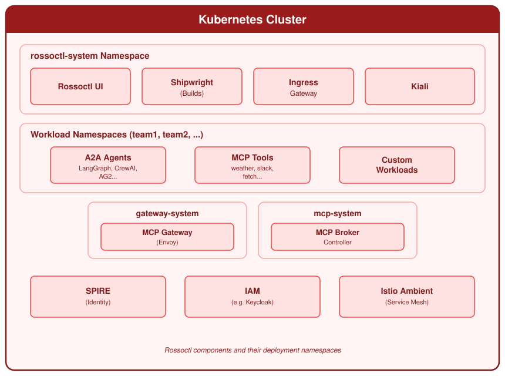

A Rossoctl cluster has four layers. This page describes each layer, and then follows one request
through all of them.

## Layer 1: your workloads

An **agent** is a container that uses the A2A protocol. A **tool** is a container that uses the MCP
protocol. See [Agents and tools](agents-and-tools.md).

Both are standard Kubernetes workloads. A workload becomes part of the platform when you create an
`AgentRuntime` resource that points to it.

## Layer 2: the data plane

Each workload in the platform receives a RossoCortex sidecar. The sidecar is an Envoy proxy and a Go
processor. It controls the traffic in both directions.

- For traffic that arrives, the sidecar validates the token of the caller. An invalid token receives
  the HTTP status 401. The request does not reach your agent.
- For traffic that leaves, the sidecar exchanges the token of the agent for a token that is valid
  only for the target. It then applies the plugins that you enabled.

The sidecar also keeps the identity documents of the workload current, and registers the workload
with Keycloak. See [RossoCortex](cortex.md).

## Layer 3: the control plane

The **operator** watches the `AgentRuntime` and `AgentCard` resources. It labels the workloads,
injects the sidecars, registers the OAuth clients, reads the agent cards and configures the traces.
See [Control plane](control-plane.md).

The **backend and the web console** give you a REST interface and a browser interface. You use them
to deploy agents and tools, to send messages to an agent, and to read traces. The
[CLI](../../reference/cli.md) uses the same REST interface.

## Layer 4: the infrastructure

| Component | Function | When you get it |
| --- | --- | --- |
| cert-manager | Certificates for the webhooks and the gateways | Always |
| Gateway API and the Istio gateway controller | Network entry for the console, Keycloak and the agents | Always |
| Keycloak | Identity provider, OAuth2 tokens and token exchange | Always |
| SPIRE | Gives an identity to each workload | `--with-spire` |
| Istio ambient mesh | mTLS between the workloads | `--with-istio` |
| Shipwright and Tekton | Builds agents and tools from source | `--with-builds` |
| OpenTelemetry collector | Collects the traces | `--with-otel` |
| MLflow | Stores the traces | `--with-mlflow` |
| Kiali and Prometheus | Network diagram and metrics | `--with-kiali` |

:::warning
The Istio gateway controller and the Istio ambient mesh are different components. The gateway
controller is always installed. It serves all network entry on `*.localtest.me:8080`. The ambient
mesh is optional. It adds mTLS between the workloads. The `--with-istio` option installs the ambient
mesh only.
:::

## The path of one request

A user asks an agent to do work, and the agent calls a tool.

1. The user signs in to the console. Keycloak issues an access token.
2. The console sends an A2A message to the agent. The message contains the token.
3. The sidecar of the agent validates the token. If the token is not valid, the request stops here.
4. The agent decides to call a tool.
5. The sidecar of the agent exchanges the token of the user for a token that is valid only for that
   tool. It then applies the plugins that you enabled. A plugin can stop the call.
6. The sidecar of the tool validates the new token, and confirms that the token names the tool.
7. The tool does the work and replies. The reply returns through both sidecars.

The identity of the user is present at each step. No step has more permissions than the user and the
agent both have. For the diagrams of each step, see
[Authentication flows](../../security/flows.md).
