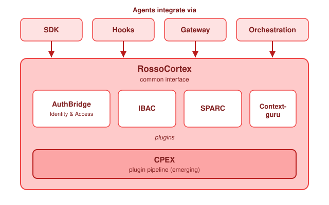

RossoCortex is the data plane of Rossoctl. It is a proxy between an agent and each external service
that the agent uses. The external services are models, tools, users and other agents.

RossoCortex intercepts traffic. It does not require a change to the code of the agent. An agent that
you did not write, or that you cannot change, therefore receives the same controls as an agent that
you wrote.



## Where RossoCortex runs

RossoCortex is one program with three deployment forms.

| Form | Location | Use |
| --- | --- | --- |
| **Sidecar** | Next to each workload, in the same pod | The standard form on Kubernetes. The operator injects it. |
| **Local proxy** | On your computer | The [laptop quickstart](../../get-started/laptop.md) uses this form. |
| **Gateway** | In front of a group of workloads | For traffic that has no sidecar. |

On Kubernetes, the sidecar is an Envoy proxy and a Go processor. Envoy moves the data. The processor
applies the rules.

## The four control points

RossoCortex separates requests from responses, in both directions. This gives four control points
around each workload.

```
 ┌────────┐  1. inbound request   ┌──────────────────────────┐  2. outbound request  ┌──────────────┐
 │        │ ────────────────────► │ CORTEX ┌───────┐ CORTEX  │ ────────────────────► │              │
 │ CALLER │                       │ inbound│ AGENT │ outbound│                       │ TARGET AGENT │
 │        │ ◄──────────────────── │        └───────┘         │ ◄──────────────────── │   OR TOOL    │
 └────────┘  4. inbound response  └──────────────────────────┘  3. outbound response └──────────────┘
```

1. **Inbound request.** Traffic that arrives at the agent. RossoCortex validates the identity of the
   caller. It confirms that a user with the correct role sent the request.
2. **Outbound request.** Traffic that the agent starts. RossoCortex confirms that the agent can reach
   the target for this user. It also examines the content for sensitive data.
3. **Outbound response.** The reply to a request from the agent. RossoCortex examines the reply for an
   attempt to control the agent.
4. **Inbound response.** The reply from the agent to its caller. RossoCortex examines the reply for
   data that the user must not receive.

Most platforms control point 1 only. Points 2 and 3 are necessary for agents. An agent that reads a
document with a hidden instruction can send a correctly authenticated request that no user asked for.

## The plugin chain

Each control point runs an ordered chain of plugins. A plugin can read the traffic, add data to a
shared record, change the content, or stop the request.

The default chain controls identity and delegation.

| Plugin | Control point | Function |
| --- | --- | --- |
| `jwt-validation` | Inbound request | Validates the signature, the issuer and the audience of the token. Returns 401 if the token is not valid. |
| `token-exchange` | Outbound request | Exchanges the token, so the agent presents a token that is valid only for the target. |

Every other plugin is optional. Parser plugins read the traffic and record its structure, so that a
later plugin can examine it. The parsers are `a2a-parser`, `mcp-parser` and `inference-parser`.

The optional control plugins use those records. See the
[Experiments](../index.md#experimental-features) group for each one, and the
[plugin catalogue](https://github.com/rossoctl/cortex/blob/main/authbridge/docs/plugin-catalog.md)
for the configuration of each one.

## Authentication and authorization are separate decisions

The chain treats the two decisions differently.

**Authentication answers one question: is this identity real?** A token that is absent or invalid is
rejected at once. There is nothing to evaluate, and an early rejection protects the platform.

**Authorization answers a second question: can this identity do this action?** Here a plugin
records its result. One decision point then evaluates each record together.

The reason is operational. One request from a user can produce many requests inside a group of agents.
Each plugin at each control point can stop traffic. A cluster then has thousands of independent
decisions, and no single place to examine after a task fails. One record and one decision point keep
both the decision and the audit data in one place.

RossoCortex is moving to [CPEX](https://github.com/contextforge-org/cpex) for that decision layer.
CPEX combines the results of policy engines such as Cedar and OPA. The controls above do not change
when the decision layer changes.

## What RossoCortex does not do

- It does not change how your agent reasons.
- It does not replace your agent framework. It is below your agent, not in place of it.
- It does not control traffic that avoids it. An agent that opens a connection outside its proxy is
  outside the security model.

## Related pages

- [Identity and trust](identity.md) explains where the identities come from.
- [AuthBridge](../../security/authbridge.md) describes the two default plugins.
- [Authentication flows](../../security/flows.md) contains the diagrams.
