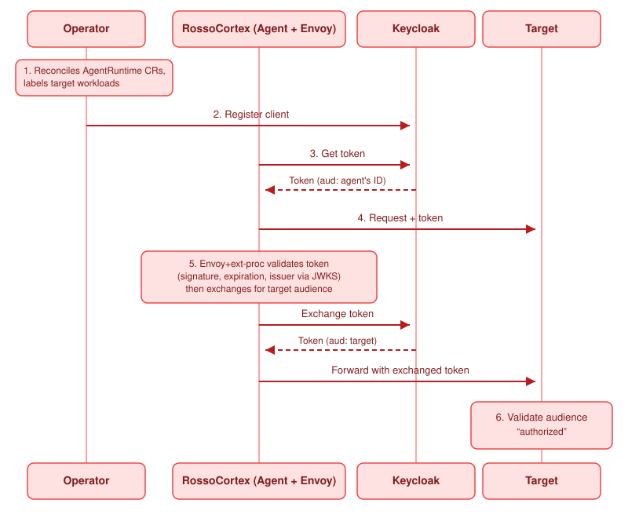

AuthBridge is the identity and access control part of [RossoCortex](../concepts/core/cortex.md). It
makes each call from an agent authenticated and correctly limited. The agent does no work for this
result.

Two plugins do the work. Rossoctl enables both by default.

| Plugin | Direction | Function |
| --- | --- | --- |
| `jwt-validation` | Inbound | Validates the token of the caller. It checks the signature, the issuer and, when you configure it, the audience. It returns the status 401 for an invalid token. |
| `token-exchange` | Outbound | Exchanges the token of the agent for a token that is valid only for the target, as [RFC 8693](https://tools.ietf.org/html/rfc8693) describes. |

## What the operator injects

When the operator adds a workload to the platform, a webhook adds three containers to the pod.

| Container | Function |
| --- | --- |
| `authbridge-proxy` | An Envoy proxy and a Go processor. It runs the inbound chain and the outbound chain. |
| `spiffe-helper` | Keeps the identity documents of the workload current. |
| Client registration | Registers the workload with Keycloak at start-up. |

The operator does not change your agent container.

## The path of one request



```
Operator                    Agent pod                     Keycloak            Target
   │                            │                             │                  │
   │ 1. add workload + label    │                             │                  │
   │ 2. register OAuth client ──┼────────────────────────────► │                  │
   │                            │                             │                  │
   │                   ┌────────┴────────┐  3. get token       │                  │
   │                   │      agent      │────────────────────►│                  │
   │                   │                 │◄────────────────────│                  │
   │                   └────────┬────────┘   aud: agent        │                  │
   │                            │                             │                  │
   │                   ┌────────┴────────┐  4. request + token │                  │
   │                   │ authbridge-proxy│                     │                  │
   │                   │  5. validate,   │────────────────────►│                  │
   │                   │     then exchange│◄───────────────────│                  │
   │                   │                 │   aud: target       │                  │
   │                   └────────┬────────┘─────────────────────┼─────────────────►│
   │                            │                             │  6. validate aud │
```

1. The operator reads the `AgentRuntime` resource, adds a label to the workload and starts the injection
   of the sidecars.
2. The operator registers the workload as an OAuth client in Keycloak.
3. The agent gets a token.
4. The agent sends a request.
5. The proxy validates the token that arrived. It checks the signature, the expiry time and the issuer.
   It returns the status 401 for an invalid token. It then exchanges the token for a token whose audience
   is the target.
6. The target validates that the audience names the target.

For the diagram of each stage, see [Authentication flows](flows.md).

## Client registration

You do not create a Keycloak client. The operator does these four steps:

1. It reads each `AgentRuntime` resource and adds the label `rossoctl.io/type: agent` or
   `rossoctl.io/type: tool` to the workload.
2. It reads the administrator credentials from the `keycloak-admin-secret` Secret in its own namespace,
   which is `rossoctl-system`.
3. It uses the SPIFFE identity of the workload as the identifier of the client.
4. It registers the client and writes the credentials to a Secret in the namespace of the workload.

The administrator credentials stay in the namespace of the operator. The namespace of an agent never
holds them. This separation is the reason to do the registration centrally.

In the console, this registration happens when you select **Secure with AuthBridge** during a
deployment. There is no container to add and no file to configure.

## Examine the configuration of one agent

To read the active chains, in execution order, with the configuration of each plugin:

```bash
rossoctl agents authbridge get orders
rossoctl agents authbridge get orders --json
```

To replace them:

```bash
rossoctl agents authbridge set orders --policy-file ./authbridge.yaml
```

The command sends the file as `text/plain` and without a change. Your comments and your key order
therefore remain, and the server validates the file. Add `--wait` to wait until the change is active.

:::note
The `--wait` option detects a change. It therefore cannot confirm a configuration that is already
active. In that case the command reaches its time limit and exits with an error. This result is correct
behaviour, and not a failure.
:::

## Run AuthBridge without Kubernetes

The same program runs on your computer. This method is the fastest way to see the chain operate:

```bash
rossoctl authbridge exec --config ./authbridge.yaml -- claude "explain this repo"
```

See [Quickstart on a laptop](../get-started/laptop.md) and
[Install the cluster CLI](../get-started/cli.md).

## The Keycloak endpoints

Use these addresses for a script or for diagnosis on a Kind installation:

```
POST http://keycloak.keycloak.svc.cluster.local:8080/realms/rossoctl/protocol/openid-connect/token
GET  http://keycloak.keycloak.svc.cluster.local:8080/realms/rossoctl/protocol/openid-connect/userinfo
POST http://keycloak.keycloak.svc.cluster.local:8080/realms/rossoctl/protocol/openid-connect/token/introspect
```

The administrator interface is at `http://keycloak.localtest.me:8080/admin/rossoctl/console/`. To get
the credentials, run `./.github/scripts/local-setup/show-services.sh`.

## Related pages

- [Identity and trust](../concepts/core/identity.md) explains the reason for this design.
- [Authentication modes](authentication-modes.md)
- [Authentication flows](flows.md)
- [Plugin catalogue](https://github.com/rossoctl/cortex/blob/main/authbridge/docs/plugin-catalog.md)
